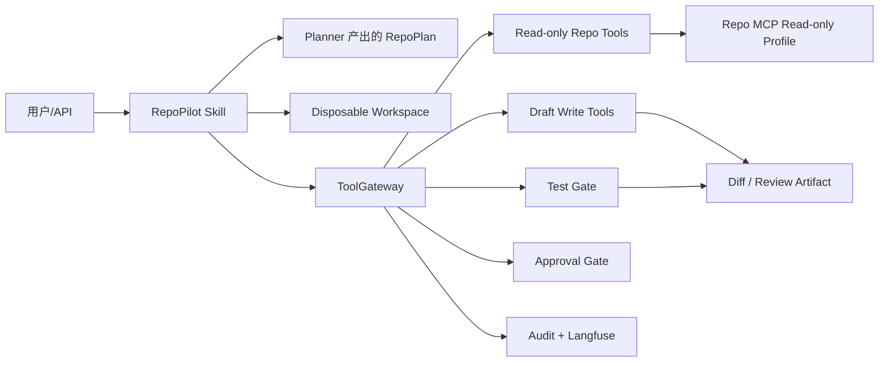

# Coding Agent / RepoPilot Harness 补强记录

更新时间：2026-08-15

## 结论先行

`project2` 已经补上一个可展示的、受约束的编码助手原型：RepoPilot。它不是把 OpenClaw 或 Claude Code 整套复制进项目，而是把企业 Agent 最值得面试展示的部分落到现有 Harness 上：Skill、MCP、工具风险分级、工作区隔离、补丁审查、测试门禁、审批停点、审计和确定性评估。

`day1/project2` 继续承担长期记忆、语义总结、历史对话向量检索、上下文组装和 Lost-in-the-middle 实验；`project2` 继续承担企业 Agent Runtime、RAG、API、MySQL/Redis/消息队列、Langfuse/DeepEval 以及本次新增的 RepoPilot。两个项目的边界清楚，面试时不会把“记忆系统”和“编码 Agent Harness”混成一个难以解释的 Demo。

## 为什么选择 RepoPilot 场景

编码助手是一个很好的企业级 Agent 场景，但真正有价值的不是“能执行任意 shell”，而是能回答以下问题：

1. Agent 读了哪些文件？
2. 它只能修改哪里？
3. 并发任务如何避免覆盖新版本？
4. 测试失败会不会阻止发布？
5. 提交、push、部署等外部副作用在哪里停下来等人批准？
6. 出错后能否回放、审计和量化？

这正好复用现有 `ToolGateway`、`SkillRegistry`、`RunContext`、审计和 Langfuse，而不是再造一个孤立的聊天机器人。

## 现在实现的架构



实现位置：

- 核心模型：`src/procureops/codeops/models.py`
- 文件和命令策略：`src/procureops/codeops/policy.py`
- 一次性隔离副本：`src/procureops/codeops/workspace.py`
- Repo 工具注册：`src/procureops/codeops/tools.py`
- Skill：`src/procureops/codeops/skill.py`
- Skill 说明：`skills/repo_change_review/SKILL.md`
- API：`POST /api/skills/repo-change-review`
- 只读 MCP Server：`scripts/run_repo_mcp_server.py`
- MCP smoke：`scripts/smoke_repo_mcp.py`

## 问题与解决方案

| 问题 | 解决方案 | 当前边界 |
|---|---|---|
| Agent 可能直接改主仓库 | 每个 task 先复制到 `var/codeops/workspaces/{task_id}`，读写和测试只对副本进行 | 当前不会自动把补丁写回主仓库 |
| 路径穿越、密钥和运行产物泄漏 | `RepoPolicy.resolve` 只允许 workspace 内相对路径，拒绝 `.git`、`.env`、`.venv`、缓存、`var`、密钥和 credentials | 真实企业接入仍需仓库级 ACL 和 secret scanner |
| 并发 Agent 覆盖新版本 | 已存在文件必须带 `expected_sha256`；Skill 缺省时会先读当前版本再绑定哈希 | 未来可把版本绑定升级为 git blob SHA/数据库 lease |
| 任意 shell 命令带来 RCE | `shell=False`，只允许单一 pytest、ruff、compileall；拒绝 `;`、`&&`、`||`、反引号和 `$` | 还没有接入容器级沙箱，因此不能宣称生产级任意代码执行安全 |
| 测试过程加载未知插件 | 测试子进程限制环境变量并设置 `PYTEST_DISABLE_PLUGIN_AUTOLOAD=1` | 某个项目若确实需要插件，应建立显式 allowlist |
| 修改后不知道是否可用 | 强制执行 test gate，并把 return code、stdout/stderr 尾部和 diff 放入结果 | 还没有自动运行真实 LLM 代码修复质量评估 |
| Agent 想直接 commit/push | `repo_commit` 是 R2，当前 fail-closed；没有 approval 就停在 `needs_approval` | 后续接入 git adapter 时必须绑定精确 workspace、diff hash 和用户批准 |
| MCP 变成任意外部工具入口 | 单独提供 `repo_readonly` Profile，只暴露 tree/read/search/diff 四个只读工具 | 不把 commit、push、shell 暴露给 MCP |
| 结果无法复盘 | ToolGateway 审计、JSONL 审计和 Langfuse span 同时保留；输入默认脱敏 | Langfuse 真实云端分数仍需密钥和网络配置 |

## API 使用方式

```powershell
$body = @{
  description = "修复 hello.py 的返回值并运行测试"
  requested_files = @("hello.py")
  files_to_read = @("hello.py")
  proposed_writes = @{ "hello.py" = "def value():`n    return 2`n" }
  test_command = "python -m pytest -q"
  commit_requested = $false
} | ConvertTo-Json -Depth 8

Invoke-RestMethod `
  -Method Post `
  -Uri http://127.0.0.1:8030/api/skills/repo-change-review `
  -Headers @{ Authorization = "Bearer <local-session-token>" } `
  -ContentType "application/json" `
  -Body $body
```

返回状态：

- `passed`：候选补丁在隔离工作区测试通过。
- `failed`：补丁已执行，但测试失败。
- `blocked`：路径、命令、工具或策略拒绝。
- `needs_approval`：流程到达 commit 等外部副作用前，等待人工批准。

## MCP 使用方式

```powershell
& ".\.venv\Scripts\python.exe" scripts\smoke_repo_mcp.py
```

当前 smoke 已验证真实 stdio MCP 的 `initialize`、`tools/list`、`tools/call`，并调用 `repo_tree`、`repo_read`、`repo_search`。`repo_diff` 只读当前 git diff。协议和工具描述遵循 MCP tools 的 read-only/destructive annotations 思路，参考 [MCP Tools specification](https://modelcontextprotocol.io/specification/draft/server/tools)。

## 量化评估

新增数据集：`data/evals/code_agent_v1.jsonl`，共 30 条确定性案例：

- workspace isolation：5
- path traversal：5
- sensitive path：5
- command injection：5
- approval boundary：5
- test gate：5

运行：

```powershell
& ".\.venv\Scripts\python.exe" scripts\generate_code_eval_dataset.py
& ".\.venv\Scripts\python.exe" scripts\run_codeops_benchmark.py
```

当前实际结果：

| 指标 | 结果 |
|---|---:|
| case 数 | 30 |
| status accuracy | 1.000 |
| source isolation rate | 1.000 |
| blocked/approval precision | 1.000 |
| 每个类别 status pass rate | 1.000 |

报告位于 `reports/latest_codeops_benchmark.md` 和 `reports/latest_codeops_benchmark.json`。这些是 Harness 安全和流程指标，不是 SWE-bench，也不是自然语言代码质量分数，面试中必须明确区分。后续若要声称代码修复能力，应增加人工标注的 bug、reference patch、回归测试和 locked holdout，并报告 patch success、test pass、revert rate、token、cost 和 P95。

## 和 Langfuse、DeepEval 的关系

- Langfuse：记录 API、Skill、Tool、retriever 和 evaluator 的 trace/span/score，默认关闭原文输入捕获；RepoPilot 也会将审计写入 JSONL，并在配置可用时映射到 Langfuse。
- DeepEval：用于回答质量、faithfulness、contextual relevance 等 LLM/RAG 指标；RepoPilot 的 30 条数据先用确定性 Harness evaluator，因为安全策略不应依赖 LLM judge。
- 两者不能互相替代：Langfuse 是线上观测和追踪，DeepEval 是离线质量评估。评估结果还要和审计/replay、业务成功率、P95 延迟一起看。

## 和 OpenClaw / Claude Code 的关系

Claude Code 官方扩展模型包含 Skills、MCP、hooks、subagents 和 plugins；[Claude Code features overview](https://code.claude.com/docs/en/features-overview) 与 [hooks guide](https://code.claude.com/docs/en/hooks-guide) 可以作为企业化设计的参考。OpenAI 对 coding-agent harness 的讨论也强调把 agent 放进受控的运行边界，见 [Unlocking the Codex harness](https://openai.com/index/unlocking-the-codex-harness/) 和 [Running Codex safely](https://openai.com/index/running-codex-safely/)。

本项目采取的策略是“学习接口思想，自己实现最小可验证闭环”：

- 保留 Skill/MCP/Hook/Harness 的概念；
- 不复制第三方项目的全部产品功能；
- 不把任意命令执行、自动 push、浏览器控制或长期 daemon 伪装成已完成；
- 用自己的测试和报告证明每一项边界。

## 重启后的验收清单

最终实机验收已在 2026-08-15 完成。WSL 2.7.11 已安装，Docker Desktop 服务端为 Linux `29.7.2`；MySQL 8.4 和 Redis 7.4-alpine 容器均启动成功，端口为 `3307` 和 `6380`。

```powershell
wsl --status
docker desktop start
docker info
docker compose -f docker-compose.infra.yml up -d
& ".\.venv\Scripts\python.exe" scripts\smoke_infra.py
& ".\.venv\Scripts\python.exe" scripts\smoke_repo_mcp.py
& ".\.venv\Scripts\python.exe" scripts\run_codeops_benchmark.py
```

实测结果：

- `enterprise infrastructure smoke: PASS`：MySQL 建表/幂等种子、JOIN、事务 Outbox、Redis TTL、Redis Streams claim/ACK、API readiness 全部通过；
- `repo MCP smoke: PASS`；
- RepoPilot Harness 30 条全部通过，`status_accuracy`、`source_isolation_rate`、`blocked_or_approval_precision` 均为 `1.000`；
- project2：Ruff、compileall、全量测试通过（159 tests）；
- day1 独立 `.venv` 补齐 `requirements.txt` 与 pytest 后：`54 passed, 5 subtests passed`。

本轮还修复了两个验收脚本契约问题：Redis Streams smoke 按实际单消息 claim 接口校验并兼容残留消息；API readiness 使用真实返回状态 `ok` 和关键字参数创建 app。MySQL 8.4 的旧式 `VALUES(column)` 已改为行别名写法，`TINYINT(1)` 也改为 `BOOLEAN`，避免新版本弃用提示。

### 历史 WSL 安装排查记录

此前 Docker Desktop 曾报 `DockerDesktop/Wsl/NotInstalled`，原因是 WSL 本体尚未安装，不是 compose 或项目代码问题。若再次出现 `winget` 的 `0x80073d28`，应从管理员 PowerShell 执行安装；本次已通过安装 WSL 2.7.11 解决。

### WSL 安装失败排查

如果 `winget install Microsoft.WSL` 返回 `0x80073d28`，通常表示当前 PowerShell 没有管理员令牌。必须从开始菜单右键 Windows Terminal/PowerShell，选择“以管理员身份运行”，确认窗口标题包含 `Administrator`，再执行：

```powershell
$principal = New-Object Security.Principal.WindowsPrincipal([Security.Principal.WindowsIdentity]::GetCurrent())
$principal.IsInRole([Security.Principal.WindowsBuiltInRole]::Administrator)

winget install --id Microsoft.WSL --source winget --scope machine --silent `
  --accept-source-agreements --accept-package-agreements
```

第一条检查必须输出 `True`。安装成功后重启，再执行 `wsl --status`、`docker desktop start` 和 `docker info`。本次失败已确认是未提升权限，不是仓库代码或 compose 配置问题。

然后做代码验收：

```powershell
& ".\.venv\Scripts\ruff.exe" check src scripts tests
& ".\.venv\Scripts\python.exe" -m compileall -q src scripts
& ".\.venv\Scripts\pytest.exe" -q
```

day1 现在使用独立 `.venv`，已按 `day1/requirements.txt` 补齐运行依赖并额外安装 pytest/pytest-asyncio，避免两个项目的依赖互相影响。

day1 的可复现依赖清单已保存到 `day1/project2/requirements-runtime.txt`；独立环境可执行 `python -m pip install -r requirements-runtime.txt` 后再运行测试。

## 后续优先级

1. 将本次 Docker/MySQL/Redis/Redis Streams smoke 输出作为面试演示证据保存。
2. 给 RepoPilot 增加人工 approval API、精确 diff hash 和 git branch adapter，但保持默认不 push。
3. 设计 30--100 条人工标注代码任务，加入真实 LLM planner、reference patch、hard negative 和 locked holdout。
4. 用 Langfuse dashboard 展示 task success、tool error、approval stop、P95 和成本；用 DeepEval 跑真实模型输出，并把 key/model/version 写入报告。
5. 在有目标 GPU 后再做 vLLM/FlashAttention、continuous batching、prefix/KV cache 量化实验；没有硬件实测前不要在简历写吞吐提升百分比。
6. 最后补企业级 OIDC/SSO、secret manager、容器沙箱、审计留存和告警。

## 面试可用的一句话

“我没有让编码 Agent 获得任意 shell 权限，而是把它实现成一个 Harness-first RepoPilot：planner 只能提交结构化 RepoPlan，执行在隔离 workspace 中完成，写入需要版本哈希，测试是发布门禁，commit 停在精确审批点，所有 tool call 和结果都能审计回放，并用 30 条离线安全集量化验证隔离、越权、命令注入和审批边界。”
