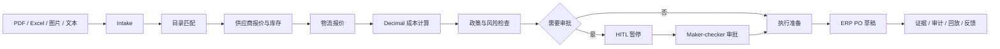

# ProcureOps Agent：项目总览与验收矩阵

## 一句话定位

我实现的不是采购聊天机器人，而是一套以采购任务为中心的多租户企业 Agent：它从多格式需求解析开始，经过目录匹配、动态供应商/库存/物流查询、确定性成本计算、风险与人工审批，最终向 ERP 生成幂等 PO 草稿，并对记忆、证据、回放、评测和持续改进进行治理。

## 最初目标是否已经满足

结论：最初提出的三组核心目标都已实现，已经可以进入项目验收和面试准备阶段。唯一需要准确表述的边界是：项目具备真实企业系统的 HTTP 适配能力和本机独立沙箱，但没有目标企业的 UAT/生产凭据，所以不能声称已连接某家公司的生产 ERP。

| 原始目标 | 结论 | 实现证据 | 面试表述 |
|---|---|---|---|
| 像 GPT/Claude 一样记住用户偏好 | 已实现 | 候选、确认、使用、纠错、软删除、TTL、租户/用户隔离、敏感字段和完整性校验 | “可治理的长期记忆”，不是无限制保存聊天内容 |
| 自主进化 | 已实现安全版本 | 反馈 → Prompt 候选 → 固定 Gold Set 离线回归 → 合规审批 → 人工发布 → 回滚 | “受治理持续学习”，生产环境禁止自改 Prompt/规则/代码 |
| 多 Agent 与监督 | 已实现并做 A/B | 单 Agent、确定性 Supervisor + 专业 Agent、FakeModel/真实模型入口三路 | 多 Agent 无显著收益，因此默认单 Agent，保留可诊断实验路径 |
| 数据库 | 已实现 | SQLite 迁移、外键、索引、乐观锁、Outbox、租户过滤、PO 持久幂等 | 本机 Profile；生产建议 PostgreSQL + RLS/HA |
| RAG | 已实现 | 多租户混合检索、ACL、引用、Corpus Hash、动态事实禁止进入知识库 | 静态知识走 RAG；价格/库存/物流/订单状态走工具 |
| Harness | 已实现 | RunContext、预算、RBAC、审批绑定、幂等、重试分类、审计、回放、模型路由和熔断 | Harness 是模型和工具之外的决策与安全控制面 |
| 端到端评测 | 已实现 | 100 条主集 + 20 条跨租户 IT 集；结果、轨迹、成本、延迟、失败分类 | 评环境最终状态，不只评最终文本 |
| 第二租户 | 已实现 | 工程机械与企业 IT 共用同一流程，只替换 Tenant Pack | 证明不是针对一组样例硬编码 |
| ERP、供应商、物流 | 已实现接入层 | local/http_sandbox/http_enterprise；鉴权、HTTPS、超时、Schema、租户、幂等与审批哈希 | 已完成生产形态适配器；生产连接需要企业 UAT 信息 |
| 不依赖 LangChain/LangGraph | 已实现 | 原生 Python 状态机、Pydantic、FastAPI、自建 Harness 与可替换 Model/Tool Adapter | 不是反对框架，而是核心能力不被框架绑定 |
| 千问文本与视觉 | 已实现适配 | Qwen 优先路由、DeepSeek/Zhipu 降级、FakeTransport 测试、真实调用脚本 | 无密钥时不伪造真实模型分数 |

## 系统主链路

## 技术职责划分

### Agent 负责

- 理解不完整或非结构化需求；
- 选择允许的只读工具；
- 编排目录、供应商和政策审阅；
- 发现信息不足并提出追问；
- 生成 advisory 建议和可诊断说明。

### 确定性代码负责

- 状态机和合法状态跳转；
- Decimal 金额、税费、运费与汇总；
- 供应商准入、报价有效期和审批角色；
- 租户隔离、权限、幂等、超时、重试分类；
- PO 写入、Outbox、回放哈希和发布门禁。

### RAG 负责

- 采购制度、目录匹配指南、供应商治理和记忆政策；
- 多租户、角色、密级过滤和引用；
- 静态、版本化、已经审批的组织知识。

### 数据库和工具负责

- 当前目录投影、供应商、报价、库存和物流；
- 任务、行项目、审批、证据、PO 草稿、队列与审计状态；
- ERP/供应商/物流系统的实时响应。

## 为什么没有把所有步骤都做成 Agent

企业采购的核心风险不是“回复不够聪明”，而是错买、重复买、越权买和无法追责。成本计算、权限、审批、状态转移和写入幂等需要确定性；LLM 只放在确实需要语义判断的窄边界。多 Agent 只有在同一数据上提升质量、安全或可诊断性时才值得成为默认架构。

## 两个租户的迁移证据

| 维度 | 工程机械租户 | 企业 IT 租户 | 复用部分 |
|---|---|---|---|
| 产品 | 液压、发动机、底盘、电器、耗材 | 笔记本、显示器、服务器、网络、安全、机房 | 目录检索合同 |
| Schema | 零件号、设备型号、序列号 | 资产标准、CPU、内存、存储、维保 | Intake 基础行模型 |
| 规则 | 1 万/5 万审批边界 | 2 万/10 万审批边界 | Policy Engine |
| RAG | 适配和配件采购制度 | IT 资产标准和安全设备规则 | 同一混合索引与 ACL |
| 动态工具 | 配件供应商与物流 | IT 渠道商与物流 | 同一 Tool Gateway |
| 工作流 | RFQ-to-PO Draft | RFQ-to-PO Draft | 完全相同 |

## 验收结论

- 主评测集：100 条，覆盖正常、模糊、工具故障、攻击和审批边界；
- 第二租户增量集：20 条，20/20，通过率与安全率均为 100%；
- 自动化测试：109/109，通过率 100%，语句覆盖率 90.29%；
- 最新三路 A/B：单 Agent、确定性多 Agent、FakeModel 模型多 Agent 均为 100/100，P95 分别约 306.0/309.6/313.2 ms；
- 自动化测试默认 FakeModel/MockTransport，不调用付费 API；
- 数据库动态事实带时间与有效期，关键字段具有证据来源；
- 高风险 PO 草稿没有有效审批时失败关闭；
- 多 Agent 没有质量收益时默认单 Agent，符合企业成本与复杂度权衡；
- 本机网站和独立 HTTP 沙箱均无需 Docker、WSL2。

## 仍然诚实保留的生产差距

- SQLite 不等同于 PostgreSQL 的 RLS、主从、连接池和灾备；
- 本地合成目录和沙箱不等同于真实企业 UAT 数据；
- 尚未拿到某家 ERP、供应商平台或物流平台的 Endpoint、凭据和字段合同；
- 没有真实脱敏采购样本，因此不能把合成集 100% 宣传为生产准确率；
- 本机免密码身份选择只用于演示，企业部署必须接 SSO/OIDC。

这些不是项目失败，而是个人项目对生产边界的正确说明。
